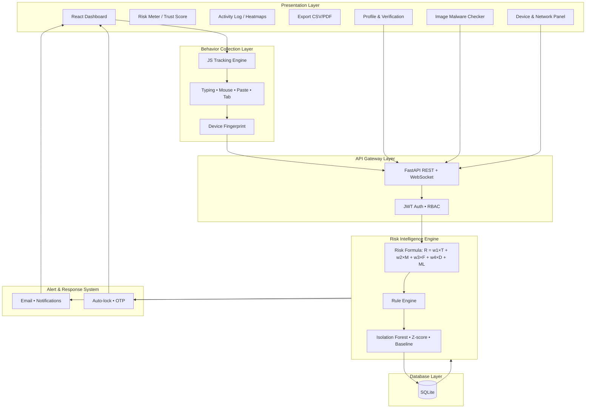

# SecureMind AI – Enterprise System Architecture

This document describes the layered architecture for the project report and viva. You can **draw this diagram** in your report using the structure below (e.g. in draw.io, Lucidchart, or Mermaid).

---

## Architecture Layers (Concept)

```
┌─────────────────────────────────────────────────────────────────────────────┐
│                     PRESENTATION LAYER                                        │
│  React Dashboard • Risk Meter • Trust Score • Activity Log • Heatmaps        │
│  Export (CSV/PDF) • Alerts UI • Role-based Views (Admin / Analyst / User)   │
│  Profile & Verification (email, company domain) • Image Malware Checker      │
│  Device & Network (IP, camera/mic/location status) • IST timestamps         │
└─────────────────────────────────────────────────────────────────────────────┘
                                        │
                                        ▼
┌─────────────────────────────────────────────────────────────────────────────┐
│                  BEHAVIOR COLLECTION LAYER                                    │
│  JS Tracking Engine • Typing (WPM, intervals) • Mouse movement • Paste       │
│  Tab/focus • Device fingerprint • Session identity                           │
└─────────────────────────────────────────────────────────────────────────────┘
                                        │
                                        ▼
┌─────────────────────────────────────────────────────────────────────────────┐
│                     API GATEWAY LAYER                                         │
│  FastAPI • REST: /api/events, /api/login, /api/register, /api/activity,      │
│  /api/me, /api/export, /api/verify/email, /api/verify/company,               │
│  /api/scan/image, /api/context • WebSocket: /ws/dashboard • JWT • RBAC       │
└─────────────────────────────────────────────────────────────────────────────┘
                                        │
                                        ▼
┌─────────────────────────────────────────────────────────────────────────────┐
│                 RISK INTELLIGENCE ENGINE                                      │
│  Mathematical Risk Model: R = (w1×T)+(w2×M)+(w3×F)+(w4×D) + ML_Score          │
│  Rule Engine • ML: Isolation Forest, Z-score, Time-series, User baseline      │
│  Trust decay • Session hijack probability • Alert level mapping              │
└─────────────────────────────────────────────────────────────────────────────┘
                                        │
                                        ▼
┌─────────────────────────────────────────────────────────────────────────────┐
│                     DATABASE LAYER                                            │
│  SQLite: users (username, phone, company_name, company_domain,               │
│  email_verified, phone_verified), activity_logs, user_locks, user_devices,   │
│  session_ips, otp_codes; ML baselines in anomaly module                     │
└─────────────────────────────────────────────────────────────────────────────┘
                                        │
                                        ▼
┌─────────────────────────────────────────────────────────────────────────────┐
│                  ALERT & RESPONSE SYSTEM                                      │
│  Email (Resend) • Dashboard notifications • Account auto-lock               │
│  OTP/MFA on high risk • Session hijack simulation (demo)                     │
└─────────────────────────────────────────────────────────────────────────────┘
```

---

## Mermaid Diagram (for report / GitHub)

Copy this into a Mermaid-supported editor (e.g. GitHub README, Notion, or [mermaid.live](https://mermaid.live)) to generate a visual:



---

## Layer Descriptions (for report Chapter 3 – System Design)

| Layer | Responsibility | Key components |
|-------|-----------------|----------------|
| **Presentation** | UI for security analytics, risk visualization, and admin actions | React, Recharts, Tailwind; role-based views; Profile & verification (email/company); Image malware checker; Device & network (IP, camera/mic/location); IST timestamps |
| **Behavior Collection** | Capture user interaction data in the browser | behaviorTracker.js: typing, mouse, paste, tab, fingerprint |
| **API Gateway** | Authentication, authorization, request routing | FastAPI, JWT, RBAC (Admin/Analyst/User); /api/verify/email, /api/verify/company, /api/scan/image, /api/me, /api/context |
| **Risk Intelligence Engine** | Compute risk score and trust; combine rules and ML | risk_engine.py, anomaly.py; formula R = (w1×T)+(w2×M)+(w3×F)+(w4×D)+ML_Score |
| **Database** | Persist users, events, locks, baselines | SQLite: users (incl. username, phone, company, email_verified, phone_verified), activity_logs, user_locks, user_devices, session_ips, otp_codes |
| **Alert & Response** | React to high risk | Email, dashboard alerts, auto-lock, OTP when high risk |

---

## Data Flow (for report)

1. **User** interacts in the browser → **Behavior Collection Layer** sends events to API.
2. **API Gateway** authenticates (JWT), applies RBAC, forwards to **Risk Intelligence Engine**.
3. **Risk Intelligence Engine** loads rule-based components (T, M, F, D), gets ML_Score from anomaly module, computes **R** and trust; persists to **Database**.
4. If **R** exceeds threshold → **Alert & Response System** triggers (lock, email, OTP); **Presentation Layer** shows alerts and updates in real time via WebSocket.

Use this architecture diagram and table in your **Chapter 3 – System Design** and refer to it in the viva.

**Implementation map:** For the exact files and endpoints that implement each layer, see **[IMPLEMENTATION.md](IMPLEMENTATION.md)**. To verify the system is running: `GET /api/health` returns `{"status":"ok", ...}`.
